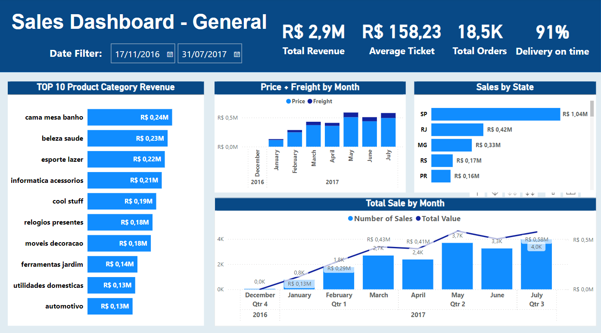
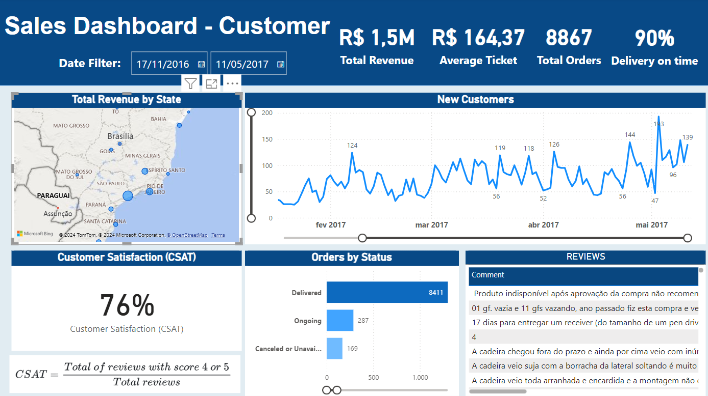
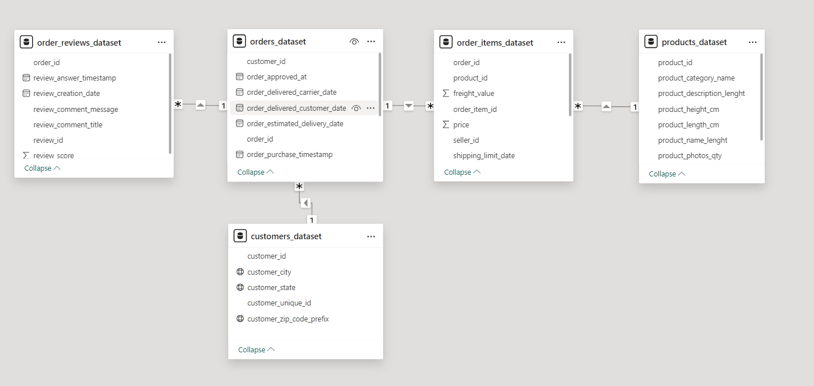

# E-commerce Dashboard

## Overview
This project consists of an interactive dashboard for analyzing sales using the Brazilian E-commerce Public Dataset by Olist. The dataset includes tables for orders, order items, customers and products allowing for comprehensive relational analysis.

## Tools Used
- PowerBI
- Power Query Editor

## Table Relationships
To enable comprehensive analysis, the following relationships were established between the tables:
- `orders_dataset` with `order_items_dataset` using `order_id`
- `order_items_dataset` with `products_dataset` using `product_id`
- `orders_dataset` with `order_reviews_dataset` using `order_id`
- `orders_dataset` with `customers_dataset` using `customer_id`

## Metrics and KPIs
- Total Revenue
- Number of Sales
- Average Ticket
- Number of Unique Customers
- Customer Satisfaction (CSAT): KPI to measure the satisfaction of the customer related to the products. 

- Top Selling Product Categories
- Sales by State
- Sales Over Time
- Order Status
- Percentage of Deliveries on Time

## Calculations
- Total Revenue = SUM('order_items_dataset'[total_value])
- Number of Sales = COUNT('orders_dataset'[order_id])
- Average Ticket = DIVIDE([Total Revenue], [Number of Sales])
- Number of Unique Customers = DISTINCTCOUNT('orders_dataset'[customer_id])
- On_time_delivery = IF( AND(orders_dataset[order_status] = "delivered", orders_dataset[order_delivered_customer_date]<= orders_dataset[order_estimated_delivery_date]), "On Time", IF(AND(orders_dataset[order_status] = "delivered", orders_dataset[order_delivered_customer_date]> orders_dataset[order_estimated_delivery_date]), "Late", "Not Delivered"))
- Percentage_on_time = DIVIDE( CALCULATE(COUNTROWS(orders_dataset),orders_dataset[On_time_delivery] = "On time"),COUNTROWS(orders_dataset))
- Top Selling Products = TOPN(10, SUMMARIZE('order_items_dataset', 'products_dataset'[product_category_name]), [Total Revenue])
- Sales by State = SUMMARIZE('customers_dataset', 'customers_dataset'[customer_state], [Total Revenue])
- Sales Over Time = SUMMARIZE('orders_dataset', 'orders_dataset'[order_purchase_timestamp], [Total Revenue])

## Visualizations
- Bar chart for top selling product categories;
- Bar chart for sales over time;
- Map chart for sales by state;
- Metric cards for total revenue, average ticket, numer of orders and percentage of deliveries on time;
- Metric card of Customer Satisfaction;
- Matrix with the reviews.

## How to Run
1. Download the file `Financial_Performance_Dashboard.pbix`.
2. Open the file in PowerBI Desktop.
3. Explore the visualizations and interact with the date filter.
